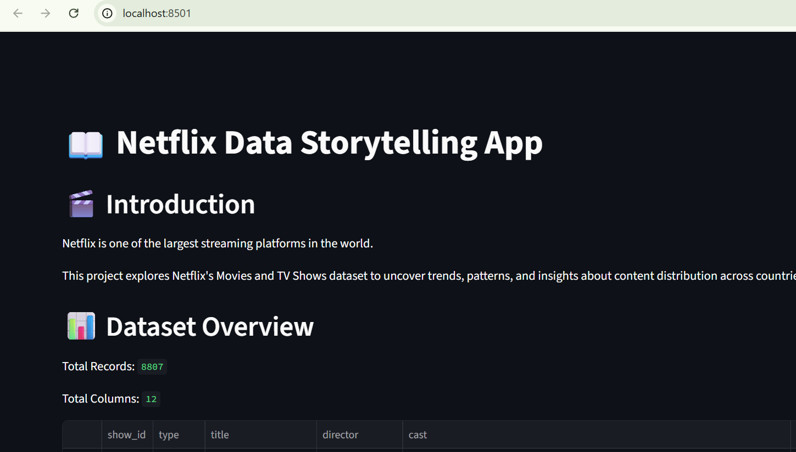
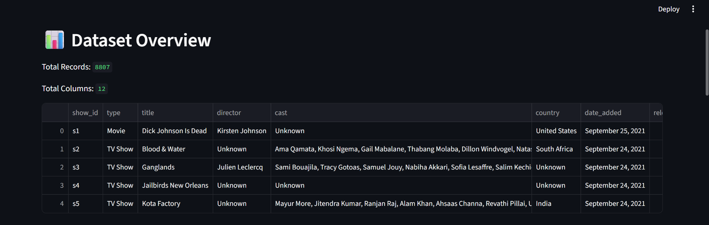
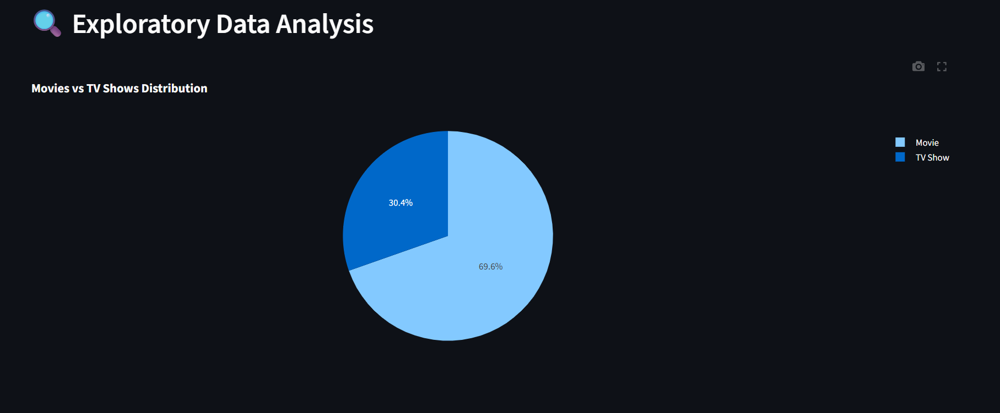
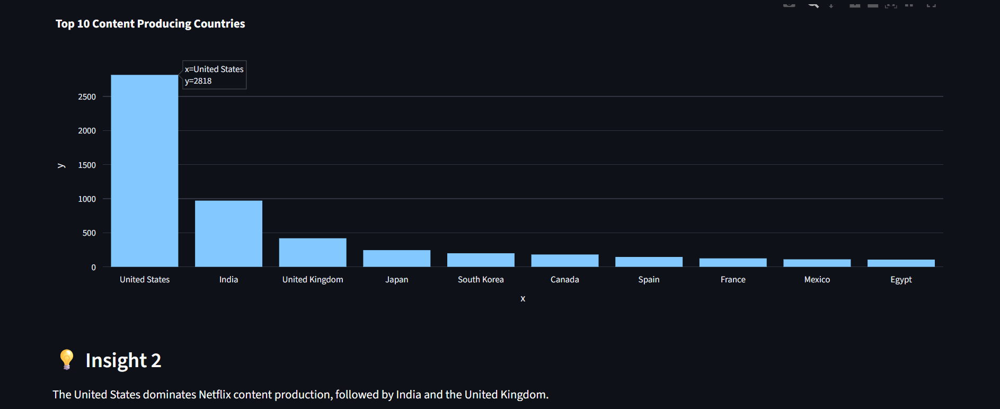
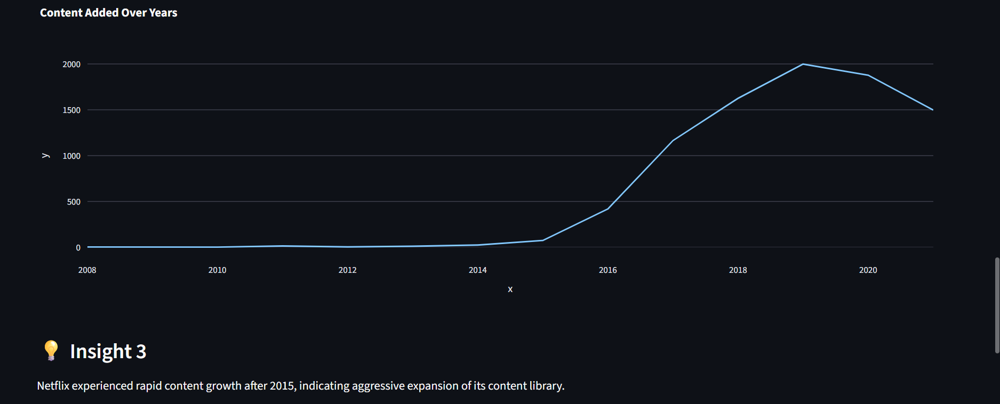
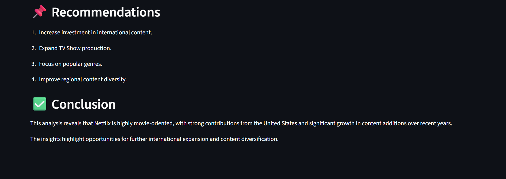

# Netflix Data Storytelling App

## Overview
This project explores the Netflix Movies and TV Shows dataset through data storytelling techniques. The application presents insights, trends, and recommendations derived from exploratory data analysis.

## Features
- Dataset Introduction
- Dataset Overview
- Exploratory Data Analysis (EDA)
- Interactive Visualizations
- Insights and Findings
- Recommendations
- Conclusion

## Technologies Used
- Python
- Pandas
- Plotly
- Streamlit

## Dataset
Netflix Movies and TV Shows Dataset

## How to Run

pip install -r requirements.txt

streamlit run app.py

## Screenshots

### Home Page

### Dataset Overview

### EDA Visualization 1

### Insight 1

### EDA Visualization 2

### EDA Visualization 3

### Conclusion

## Author

swapna
